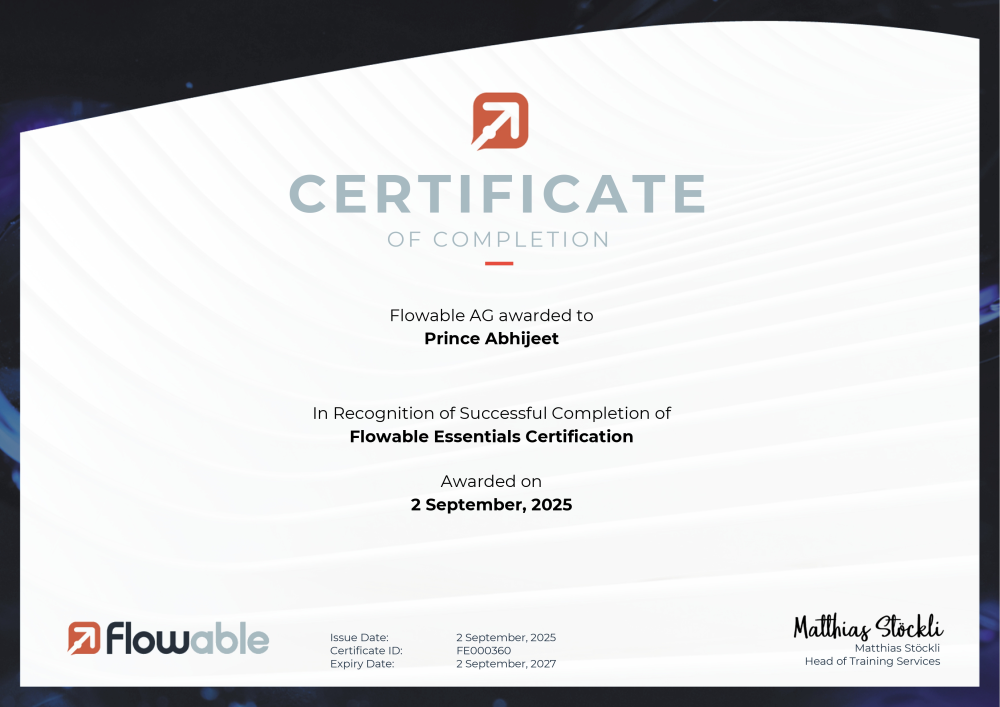
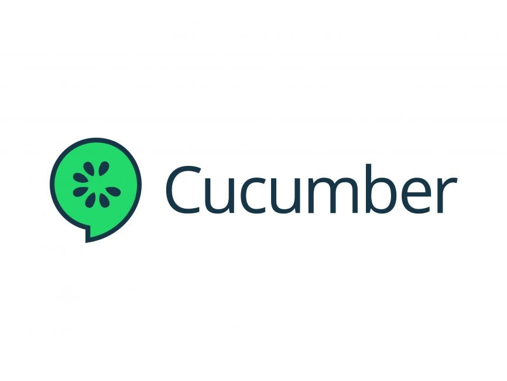
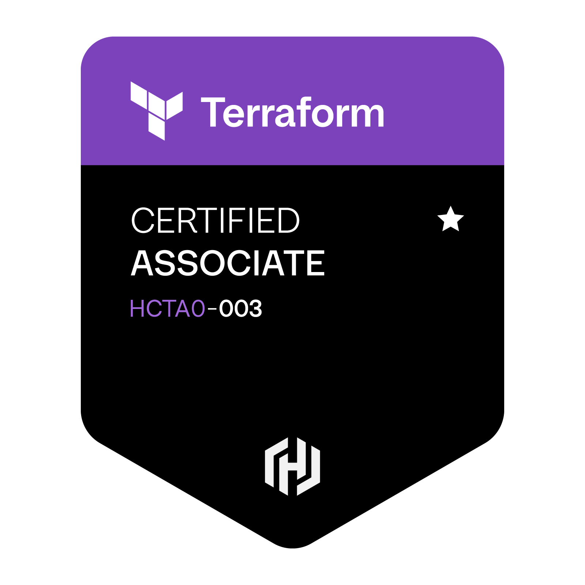

 
  

<!-- Hello, it's Prince Abhijeet -->

  

<!-- Skill icons -->

  

<!-- Profile Views -->

  

<!-- About me -->
<h2 id="about"> :small_orange_diamond: About me</h2>

  10+ years helping organizations develop, maintain & scale Java-based dynamic, real time web applications.
  

  Microservices | Java Backend | Object Oriented Programming | Server Side Programming | API Design & Development | Real-time Data Streaming | Business Process & Workflow Automation | Azure Cloud

<!-- Skill badges -->
<h2 id="skills"> :small_orange_diamond: Skills</h2>

  
  
  
  
  
  
  
   
  
  
  
  
  
  
  

  
  
  
  
  

<!-- Certifications -->
<h2 id="certifications"> :small_orange_diamond: Certifications 🎓 </h2>

  <table style="width:100%; table-layout:fixed;">
    <colgroup>
      <col style="width:16.66%">
      <col style="width:16.66%">
      <col style="width:16.66%">
      <col style="width:16.66%">
      <col style="width:16.66%">
      <col style="width:16.66%">
    </colgroup>
    <tr>
      <!-- Icon Row -->
      <td align="center">
        
      </td>
      <td align="center">
        
      </td>
      <td align="center">
        
      </td>
      <td align="center">
        
      </td>
      <td align="center">
        
      </td>
    </tr>
  </table>

<!-- Connect with me -->
<h2 id="connect"> :small_orange_diamond: Connect</h2>

    
    

